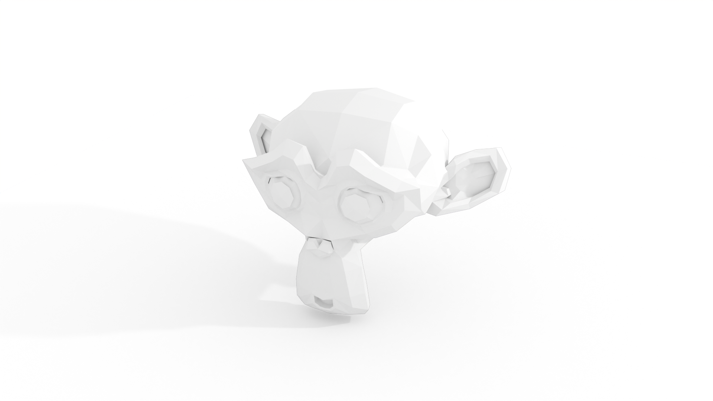

## 写在前面

这一部分笔记会涵盖渲染图像，视频时常用的设置，如何实现特定的效果，也会涉及少量的布光技巧。

## 正文

### 如何实现纯白的背景

这里的纯白背景不仅仅是背景纯白，还要求能看到模型的阴影，效果如下：

其实这个效果也能够在保留物体的光照效果和阴影的条件下直接改变背景的颜色，实现方法来自这里[How to make a PERFECT WHITE background in Blender in 1 Minute - YouTube](https://www.youtube.com/watch?v=EzEPYuIWj-E&ab_channel=PointCloud)。

为了实现这个效果，要有几个需要设定的选项：

1. 为了让物体的阴影显示出来，在物体的底部创建一个足够涵盖所有阴影大小的平面。选中这个平面，在平面的 `Object Properties>Visibility` 下勾选 `Shadow Catcher` 。这样可以让物体的阴影显示到平面上，同时不会让底部的平面影响最终的出图效果。
2. 在世界属性中让背景颜色设置为纯白色，适当调整光照的强度，就可以达到上图中的效果。

如果想要的背景不是纯白，二十灰色，或者别的颜色，只需要在世界属性中改变背景颜色就可以了。
