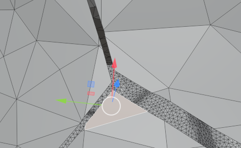

## 写在前面

经过上一次基本的学习，大致掌握了 `blender` 的基本用法，但是实际上还有的要求没能满足，也有很多可以补充的技巧，可以大大简化之前手写代码的流程。

## **笔记内容**

### **遇到的问题**

#### **从某一些选中的线将模型的表面分开，让原本邻接的面可以独立活动**

这个问题想实现的效果如下图所示：



原来这些面都相连的，移动其中一个会让所有相邻的面同时移动，现在可以独立移动三个区域不影响旁边的面，制造出上图中的缝隙。

第一个问题是选取什么边作为分割这些面的“切口”。可以在编辑模式下手动选择或者用环形选择工具快速选择，也可以类似在 `obj`模型文件中用：

```
l 1 2
l 2 3
```

这种格式，将顶点和连接顶点的线导入到 `blender` 中，导入后可以把导入的元素转化成 `curve` ，调整粗细，材质以方便渲染，也可以让它转化为一个 `mesh` ，用快捷键 `ctrl`+`J` 在物体模式下和原模型合并到一起，`blender` 会自动用线去分割线经过的面，如果有的线没有分割经过的面，进入编辑模式，全选面，在顶部导航栏找 `Face`>`Weld Edges into Faces` 可以确保边整合到面上，但是可能出现非流形。当两个模型合并之后，可以用环形选择工具快速选中这些线。

当已经选定一些边之后，进入编辑模式，在顶部导航栏的 `Mesh`>`Split`>`Faces by Edges`

就可以用这些边把原本相邻的两个面分开，使用 `G` 调整位置的时候就可以不影响旁边的边，单独调整一个面。

要注意的是，如果打开了衰减编辑，移动一个面的时候是不会出现裂缝的，要确保裂缝出现最好先关闭衰减编辑，选中多个面同时移动，当裂缝出现后再开启衰减编辑。
