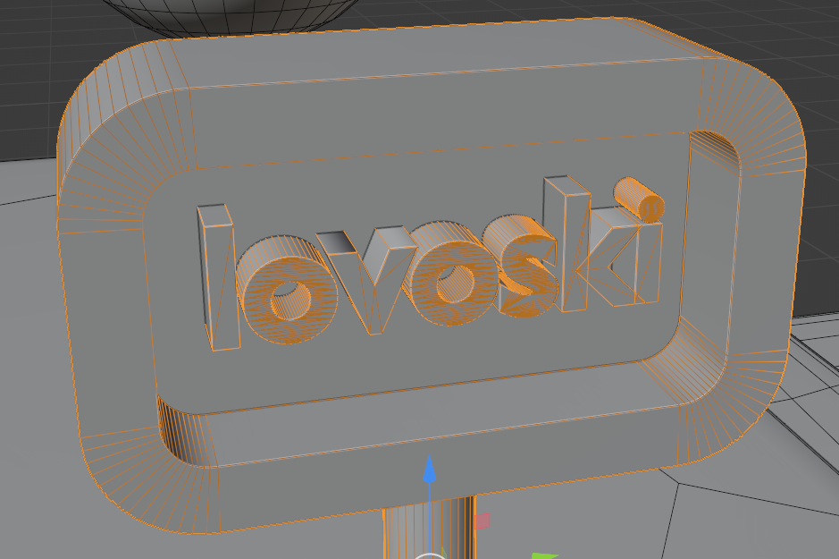

## **写在前面**

经过上一次基本的学习，大致掌握了 `blender` 的基本用法，但是实际上还有的要求没能满足，也有很多可以补充的技巧，可以大大简化之前手写代码的流程。

## **笔记内容**

### **常用的快捷键操作**

`ctrl`+`I`：在物体模式下**反选物体**，整体是所有的物体。

`H`：**隐藏**选中的物体，方便操作，其实也可以用`/`进入到隔离模式，效果类似。

`alt`+`H`：**显示所有物体**，包括隐藏物体。也可以在右上角的操作栏目里面一个一个打开眼睛图标。

`鼠标右键单击`+`设置原点`：在这里可以**调整物体和它的原点**。平移，旋转，缩放等变换都是相对于一个物体的原点的。这个设置中可以把物体的几何中心移动到当前远点的位置上，也可以把当前的原点移动到物体的几何中心上。

`ctrl`+`.`：可以**手动选择原点的位置**，制作动画的时候选择缩放原点很重要。

`I`：**设置选中物体的关键帧**，修改之后最好在对应的关键帧再保存一次。注意不要在第0帧设置关键帧，不然不会有动画效果。

`ctrl`+`L`：**关联选中的物体的一些属性**，要注意的是关联之后改变其中的一个，所有的关联物体的属性都会改变。前一篇笔记介绍了用这个方法来关联材质，这里介绍关联动画数据的用法。如果我们想让一些物体在通过关联获得了一些属性，比如材质，动画之后，**能够独立调整这些属性，不影响关联的其他物体相应属性**，可以选中我们想要“独立”的物体，在顶部导航栏里面的 `Object`>`Relations`>`Make Single User` 中选取我们希望让这个物体独立的属性，应用之后，就可以独立调整了。

`ctrl`+`P`：**把选择的物体绑定父子关系**，最后一个选中的物体是之前所有选中物体的父亲。这样设置的好处是，当父亲做出变换，儿子也会做出变换，但是儿子的变换不影响父亲的变换。动画制作的时候可以大大减少工作流程。

### **遇到的问题**

#### **从某一些选中的线将模型的表面分开，让原本邻接的面可以独立活动**

这个问题想实现的效果如下图所示：


原来这些面都相连的，移动其中一个会让所有相邻的面同时移动，现在可以独立移动三个区域不影响旁边的面，制造出上图中的缝隙。

第一个问题是选取什么边作为分割这些面的“切口”。可以在编辑模式下手动选择或者用环形选择工具快速选择，也可以类似在 `obj`模型文件中用：

```
l 1 2
l 2 3
```

这种格式，将顶点和连接顶点的线导入到 `blender` 中，导入后可以把导入的元素转化成 `curve` ，调整粗细，材质以方便渲染，也可以让它转化为一个 `mesh` ，用快捷键 `ctrl`+`J` 在物体模式下和原模型合并到一起，`blender` 会自动用线去分割线经过的面，如果有的线没有分割经过的面，进入编辑模式，全选面，在顶部导航栏找 `Face`>`Weld Edges into Faces` 可以确保边整合到面上，但是可能出现非流形。当两个模型合并之后，可以用环形选择工具快速选中这些线。

当已经选定一些边之后，进入编辑模式，在顶部导航栏的 `Mesh`>`Split`>`Faces by Edges`

就可以用这些边把原本相邻的两个面分开，使用 `G` 调整位置的时候就可以不影响旁边的边，单独调整一个面。

要注意的是，如果打开了衰减编辑，移动一个面的时候是不会出现裂缝的，要确保裂缝出现最好先关闭衰减编辑，选中多个面同时移动，当裂缝出现后再开启衰减编辑。

#### **一些几何体建模的时候组合在一起了，怎么将它们分开成不同的几何体，怎么组合回去**

可以在编辑模式下用快捷键 `P` ，选择 `By loose parts` ，可以把几个几何体分开。

分开后可以选中这几个几何体，然后在物体模式下 `ctrl`+`J` 将它们合并成一个几何体。这个合并的方法只是让他们在选中的时候被视为一个整体，不会改变模型的拓扑性质。如果要让这些模型从拓扑上成为一个整体需要采用修改器。如果这些物体中有的物体只包含有边和点，可以采用上面问题的解法让你跟着两个模型真正合并。

有一个要注意的地方，`ctrl`+`J` 只能合并 `mesh` ，像是文字，曲线这种物体，首先要`鼠标右键单击`+`convert to` 讲这些物体转化成 `mesh` ，然后才能和已有的 `mesh` 合并。比如下图中的效果：



#### **动画制作的流程**

这里只讨论简单的平移，旋转，缩放动画的大致流程。

动画中首先要了解的是**关键帧的概念**，关键帧可以记录物体在这一时刻的各种属性，比如说**缩放大小，位置，甚至是修改器的参数**（这说明有的修改器不用急着应用，应用之后就不能在动画中修改参数了，比如阵列修改器中阵列的个数）。通过选中一个物体，在物体模式下按快捷键 `I` 可以快速创建关键帧。也可以在右边的工具栏目里面手动修改一些参数，然后点击右边的菱形按钮记录关键帧属性。在底部的时间轴可以选中关键帧，移动关键帧所在的位置。

当确定了所有想要的关键帧，可以考虑渲染导出动画，可以直接导出视频，也可以**导出图片阵列**。图片阵列更方便保留信息，不至于电脑渲染了一部分后崩溃损失全部数据。

渲染得到图片阵列之后，可以再 `blender` 中打开 `Video Editting` 界面，用 `shift`+`A` 把图片阵列全选导入到视频编辑器里面，再**导出成视频**。（`blender` 自带剪视频的功能，这里面的快捷键和`blender` 中建模的快捷键是基本相同的）
