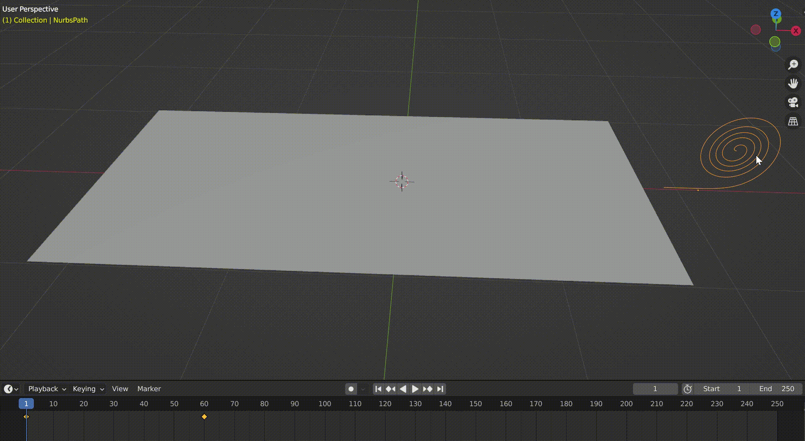
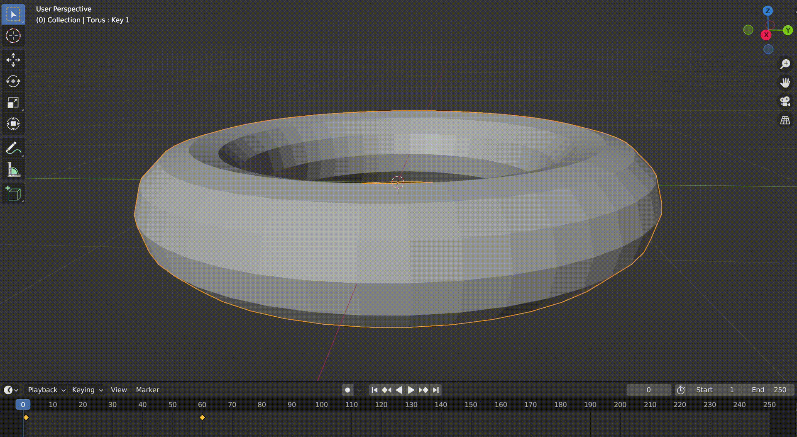

## **写在前面**

上一篇笔记整理了**模型编辑**的常用工具，这一篇主要讲如何**制作动画**，特别是用于演示的动画。

## **学习笔记**

### 动画中的关键帧

要了解 blender 是如何实现动画的，首先要了解关键帧的概念。blender 可以记录下模型在某一帧下面的很多属性，包括位置，旋转角度，缩放大小，形状，刚性，重量等等。在右下方的属性栏目里面，每一个能够被关键帧记录的属性在右侧都会有一个这样的标志：

右侧会有一个白色的小点。在底部的时间轴可以选择当前所在的帧，在上图的特定属性处按下快捷键 `I` 可以在时间轴的当前帧记录下这个属性的值，之后在底部的时间轴改变当前所在的帧，重新记录同一个属性改变后的值，就可以在这两帧之间实现动画效果。

并且，通过把底部时间栏拉起来，可以改变关键帧到关键帧之间的过渡方式，可以是线性过渡，也可以自定义非线性的过渡方式。

### 卷轴滚动的效果

这个动画的效果如下：

实现这个动画效果的核心是曲线修改器(curve modifier)。blender 中允许一一条曲线为参考，扭曲形变一个模型，如果我们首先创建一个扭曲的曲线，然后用曲线修改器把这个模型和曲线绑定，移动曲线的时候，就会实时作用于模型的形状。为曲线的位置添加关键帧，再在渲染的时候隐藏曲线，就可以实现卷轴滚动的效果。

当然，谈及曲线修改器的应用，就远远不止实现这个动画效果。我们可以扭曲曲线来实现模型的扭曲，让原本平直的模型按照曲线的形状弯曲，更多的应用场景在需要的时候再记录。

### 模型展开的效果

这个动画效果如下：

这个动画效果在之前的**模型编辑**笔记部分提到过，核心是利用 blender 中的 shape keys 属性关键帧。

在右下角的物体数据属性(object data properties)中，可以看到 shape keys 的设置选项。

在这个选项中可以添加 shape keys ，添加并选中一个 shape key 之后，进入编辑模式，我们可以对物体的点，线，面作各种变换，调整到想要的效果之后，退出编辑模式。

接下来可以通过调整之前选中的 shape key 下方的 value 数值来在原本的模型和变化之后的模型之间变化，注意到这个 value 是可以作为关键帧属性的，通过在时间轴删记录两个 value 值不同的关键帧，就可以实现想要的动画效果。

不过 shape keys 本身的应用也远远不止这个，似乎在和骨骼联系之后，可以给人物模型做出非常复杂的表情动画，但目前没有遇到适用的场景，有待将来学习。

### 动画最终渲染出图，合成视频

使用 blender 渲染动画的时候，建议把渲染出图设置为图片序列（这样的好处是渲染的每一帧都保存下来，即使中断了也可以从中断的地方重新开始渲染），并且指定好渲染结果的保存位置，设置这些的位置在 3.6.1 中位于 `Output Properties` 中的：

渲染完成之后，可以直接用 blender 内置的视频编辑器简单编辑图像序列，重新导出为视频格式。

使用 blender 内置的视频编辑器的时候，点击下方的 sequencer ，`shift+A` 添加图像序列，接着在右上角的 `Output Properties` 中设置如下：

上面的一些设置也可以根据具体需要更改，最后 `ctrl+f12` 渲染动画，可以在指定路径得到合成好的动画。
