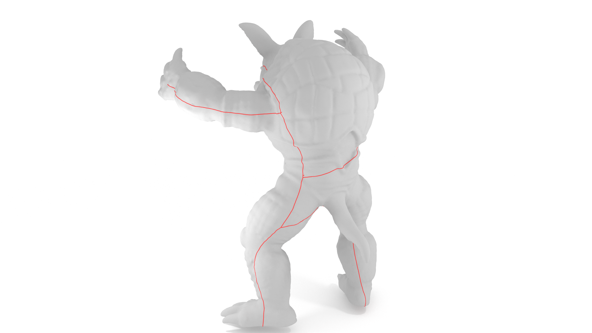

## Quick Start

### Useful Commands

- 创建新的**post**
```bash
hexo new post "new-post-name"
```
- 开启本地临时查看的**server**
```bash
hexo server
```
- 部署到github对应的分支
```bash
hexo deploy
```

### Latex Support

占据单行的数学公式：

$$
\int_{a}^{b}f(x)\ dx = e^{x^2}
$$

除了上面的单行数学公式，还有矩阵:

$$
\begin{pmatrix}
  -5&5&0&0&0 \\\\
  -3&0&4&0&0 \\\\
  0&-7&0&7&0 \\\\
  0&0&1&-1&0 \\\\
  0&0&0&-4&4 \\\\
  0&-2&0&0&2
\end{pmatrix}
$$
除了上面说的，还支持表格：
$$
\begin{array}{|c|c|c|c|c|c|c|c|}
  \hline
  {}&{e_{ab}}&{e_{ac}}&{e_{bd}}&{e_{dc}}&{e_{de}}&{e_{be}}\\\\
  \hline
  {A}&{-5}&{-3}&{0}&{0}&{0}&{0}\\\\
  \hline
  {B}&{5}&{0}&{-7}&{0}&{0}&{-2}\\\\
  \hline
  {C}&{0}&{3}&{0}&{1}&{0}&{0}\\\\
  \hline
  {D}&{0}&{0}&{7}&{-1}&{-4}&{0}\\\\
  \hline
  {E}&{0}&{0}&{0}&{0}&{4}&{2}\\\\
  \hline
\end{array}
$$

但是需要注意，在这里`latex`的换行要用`\\\\`而不是再`latex`中用的`\\`

### Insert a Image



这是没有`title`的图片，但是这样效果就可以了

### Code Syntax

```cpp
void evaluate_running_time(std::function<void(void)> &&code_block, const std::string block_name) {
  auto start = std::chrono::high_resolution_clock::now();
  std::cout << "start code_block:" << block_name << std::endl;
  code_block();
  auto end = std::chrono::high_resolution_clock::now();
  std::chrono::duration<double> time = end-start;
  std::cout << "end code_block:" << block_name  << ", running time : " << time.count() << " s" << std::endl;
}
```
显示代码的效果不是很好，而且切换到暗色模式会比较难受，但是已经能看了，比较合理的方式是加上一个重定向到专门repo的链接

### Quote Block


Do not just seek happiness for yourself. Seek happiness for all. Through kindness. Through mercy.


这样的引用视觉效果很好

### Online Resource
- codesandbox
<iframe src="https://codesandbox.io/embed/hexagon-test-6ksskk?fontsize=14&hidenavigation=1&theme=dark"
     style="width:100%; height:500px; border:0; border-radius: 4px; overflow:hidden;"
     title="hexagon-test"
     allow="accelerometer; ambient-light-sensor; camera; encrypted-media; geolocation; gyroscope; hid; microphone; midi; payment; usb; vr; xr-spatial-tracking"
     sandbox="allow-forms allow-modals allow-popups allow-presentation allow-same-origin allow-scripts"
   ></iframe>