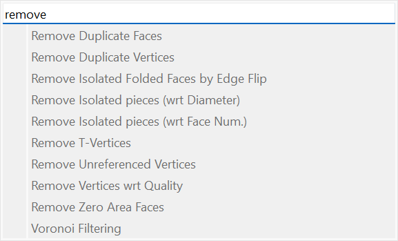
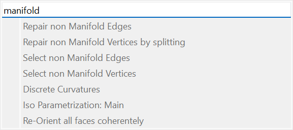
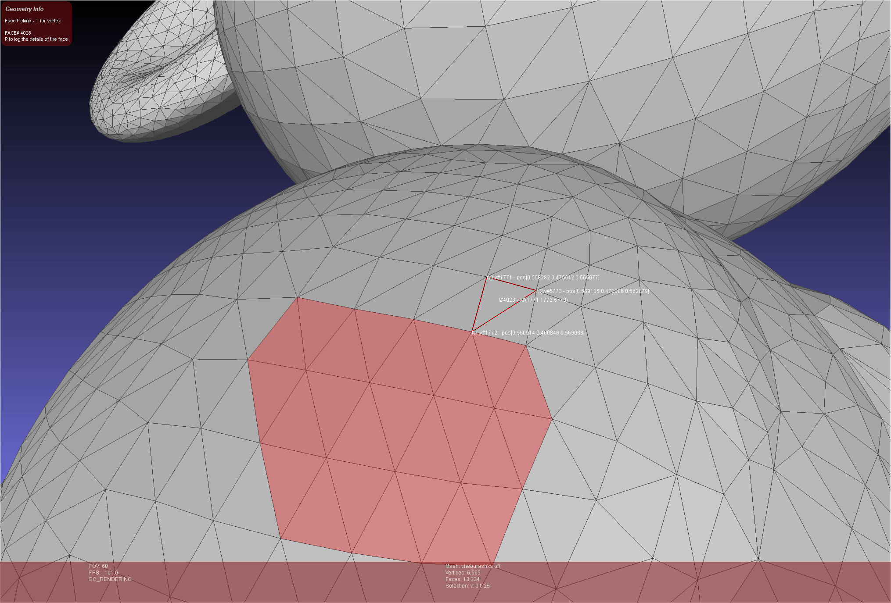
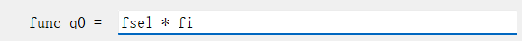
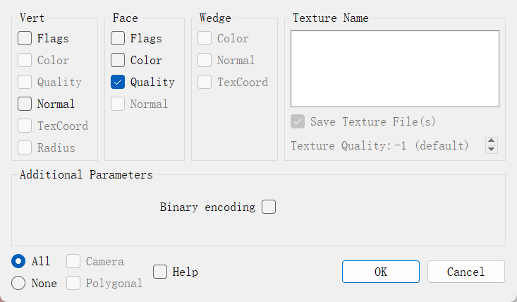
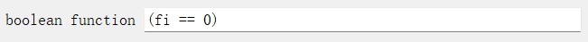

写这一篇笔记主要是记录我在用`meshlab`处理模型中遇到的问题和相应的解决方案。
## 一些常用的快捷键
- `ctrl`+`f`：打开右上角的查询窗口，可以用来快捷输入要处理的操作
- `鼠标中键拖动`：平移模型，用来更好观察模型

## 处理问题的常用方法
下面是我遇到过的问题和解决方案
### 得到的模型包含非流形边、非流形顶点
引用下面对于非流形顶点的定义
>vertices that belong to **wire and multiple face edges**, **isolated vertices**, and vertices that belong to **non-adjoining faces**.

在上面的描述中， `wire and multiple face edges` 指代的是一条与不少于两个面相关联的边，一般也称为**非流形边**，流形中的边至多只会和两个面关联（这两个面共享的边）。这种边的顶点属于非流形顶点。

除了上面这种顶点，如果两个面除了这个顶点之外，没有别的共享顶点，这个唯一的公共顶点也是非流形顶点。其实孤立的顶点也属于非流形顶点，也就是 `isolated vertices` 。

`meshlab` 中可以在查询窗口里面输入 `remove` 。出现的下拉选择框如下图:



- `remove unreferenced vertices` 可以去除孤立点。
- `remove duplicate vertices` 可以合并位置完全相同的顶点，这一个选项除了有时候能除去非流形顶点，也可以用来合并一些有相同顶点的面。这在很难判断一些面的相邻关系的时候很有用，因为这是可以把每个面的所有顶点全部都输出，再用这个选项把重复的顶点去掉，得到一个由多个面组成的曲面。
- `remove duplicate faces` 类似上面除去位置完全相同的顶点，这可以合并位置完全相同的面。

除了上面的办法，还可以输入 `manifold` 找到下面的方法。有的时候处理过一次之后，导出保存，重新处理一次可能也会有效果。



### 需要得到选中区域中所有面的 `index`

如果只需要得到获得一个面的信息，可以点击顶部 `dock` 中的黄色图标获得一个面的具体信息。



但是这样显示的效果有时很难看清楚。而且没办法同时显示很多面的信息，所以有下面的办法。
1. 首先通过选择工具选择一些面（类似于上图中的红色区域）
2. 在搜索框中输入 `per face quality function` ，在出现的对话框中填入 `fsel * fi`：



3. 上面的公式中 `fsel` 对于被选中的面是 `1` ，没选中的面为 `0` ， `fi` 是一个面的 `index` 。
4. 接下来将处理过的模型导出为 `.ply` 文本格式，不要选择二进制编码。



5. 得到 `.ply` 模型文件之后，可以用下面的 `python` 脚本把所有选中的面写到一个单独的文件里面。
```python
from sys import argv
from sys import exit
if len(argv) < 2:
  print('usage:\n[script] [ply_file]')
  exit(-1)
fids = open('fids.txt', 'w+')
with open(argv[1], 'r') as f:
  for line in f:
    numbers = line.split()
    last_number = numbers[-1]
    if len(numbers) < 5:
      continue
    if not last_number.isdigit():
      continue
    if last_number != '0':
      fids.write(last_number+'\n')
```

### 通过已有的 `index` 选中顶点或者面

最常用的方法是在搜索框里面输入 `conditional selection` 可以找到选择点和选择面的对话框，可以输入 `bool表达式`。


