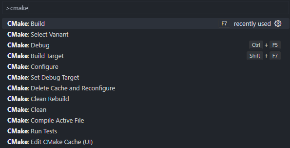

因为需要用到的工具大多只有`windows`平台的，我的代码环境只有少量运行在`wsl2`上，大部分需要在`windows`编译运行。为了维护c++用到的大量第三方库，我用[vcpkg](https://vcpkg.io/)和[cmake](https://cmake.org/)搭建出c++的编译工具链。我下面直接用Q&A的方式快速表明解决方案。

## vcpkg 国内下载源很慢，镜像网站资源不全怎么处理？
- 可以参考[这里的解决方案](https://zhuanlan.zhihu.com/p/383683670)，通过再环境变量里面添加一项
```
X_VCPKG_ASSET_SOURCES
```
让这项的值为
```
x-azurl,http://106.15.181.5/
```
这样可以让大部分的资源都从镜像网站下载，但是有的镜像网站值镜像了部分常用的包，还有的仍然是从`github`上下载的。
- 一个办法是`git`加上代理，通过命令
```powershell
git config --global http.proxy "<ip>:<port>"
git config --global https.proxy "<ip>:<port>"
```
让`git`发送`http`和`https`请求的时候走代理端口，`clash`的默认端口号是7890。
- 另外一个比较痛苦的方法是手动下载需要的包，按照vcpkg下载时的一则信息
```
... https://... -> ... 
```
手动去前面的网址下载需要的包，下载完后重命名为箭头后面的名字，放到vcpkg根目录下面的download文件夹里面，下一次重新运行`vcpkg install ...`的时候会找到这个下载好的文件。

## libigl 的一些组件 [cgal, glfw, imgui] 很难完整下载下来安装

- 如果给git加上代理也没有作用，可是采用下面的办法。
- 因为这种小组件依赖了一些找不到下载地址的`submodule`，但是这些组件的源代码都在`libigl`的源码包里面，直接把`libigl`的源代码覆盖到`vcpkg/installed/x64-windows/include`里面去，下一次重新安装的时候会提示覆盖已有文件，然后能成功编译了。

## vscode 怎么结合 cmake 编译调试程序？

- `vscode`有一个微软的官方插件`CMake Tools`，集成了`cmake`的功能，确保安装了`cmake`并添加到环境变量之后可以直接用`ctrl`+`shift`+`p`调出命令盘，输入`cmake:`，接下来选择其中的`configure`，`build`就可以了。下面是`vscode`调出的操作盘。

- 如果需要给程序添加断点，逐步debug调试，可以在当前的项目根目录的`.vscode`文件夹里面创建或者修改`settings.json`为下面的样式
```json
{
    "cmake.configureSettings": {
        "CMAKE_TOOLCHAIN_FILE": "...\\vcpkg\\scripts\\buildsystems\\vcpkg.cmake"
    },
    "cmake.debugConfig": {
        "args": ["a", "b", "c"]
    }
}
```
上面的配置文件指定了`cmake`编译使用`vcpkg`的工具链，路径不全为本机上vcpkg的安装位置下的`scripts/buildsystems/vcpkg.cmake`文件。下面的是在`debug`的时候需要给二进制文件传递的命令行参数，上面的参数等价于在命令行里面执行
```powershell
.\some_binary.exe a b c
```

## 我该怎么组织一个自己的 cmake 项目？
