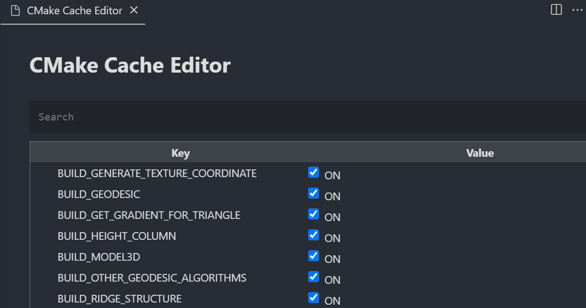

因为需要用到的工具大多只有 `windows`平台的，我的代码环境只有少量运行在 `wsl2`上，大部分需要在 `windows`编译运行。为了维护c++用到的大量第三方库，我用[vcpkg](https://vcpkg.io/)和[cmake](https://cmake.org/)搭建出 c++ 的编译工具链。

## vcpkg 下载速度太慢

比较有效的办法是确保 `vcpkg` 在下载包的时候走的是代理端口，最好把 `clash` 的全局代理打开，并且确保全局代理的模式是 `http(s)` 。如果设置成功了，在下载的时候会显示：

```
-- Automatically setting HTTP(S)_PROXY environment variables to "127.0.0.1:7890".
```

可以参考[这里的解决方案](https://zhuanlan.zhihu.com/p/383683670)，通过在环境变量里面添加一项，名称和值分别在下面。

```
X_VCPKG_ASSET_SOURCES
```

```
x-azurl,http://106.15.181.5/
```

这样可以让大部分的资源都从镜像网站下载，但是有的镜像网站值镜像了部分常用的包，还有的仍然是从 `github`上下载的。如果之后有机会，也可以考虑自己设置一个镜像网站。
一个办法是 `git`加上代理，通过命令

```powershell
git config --global http.proxy "<ip>:<port>"
git config --global https.proxy "<ip>:<port>"
```

另外一个比较痛苦的方法是手动下载需要的包，按照vcpkg下载时的一则信息

```
... https://... -> ... 
```

手动去前面的网址下载需要的包，下载完后重命名为箭头后面的名字，放到vcpkg根目录下面的download文件夹里面，下一次重新运行 `vcpkg install ...`的时候会找到这个下载好的文件。

## 显示 vcpkg 安装过的库的 cmake 信息

一般的库在编译安装完成之后都会打印怎么在 `CMakeLists.txt` 文件中用 `find_pakage` 找到这个包的函数，比如说：

```cmake
# this is heuristically generated, and may not be correct
find_package(glad CONFIG REQUIRED)
target_link_libraries(main PRIVATE glad::glad)
```

但是之后可能就找不到这个信息了，这时候可以再运行一次 `vcpkg install <package-name>` 打印信息

## vcpkg 的包版本问题

因为库的更新，有的时候库会改变下面模块的名称，这会让之前写的 `CMakeLists.txt` 直接 configure 的时候出问题，比较典型的例子就是 `libigl` 从 2.3 更新到 2.4 之后下面的模块 `igl::core igl::common` 改成了 `igl::igl_core` 。

vcpkg 自己提供了在项目的根目录下编写 `vcpkg.json` 的方式管理项目用到的库的版本。方法可以参考[这里](https://zhuanlan.zhihu.com/p/352709760)。

还有一个另外的办法，如果在 `CMakeLists.txt` 里面发现 `find_package` 制定了版本信息，比如下面这样。

```cmake
find_package(libigl 2.3 CONFIG REQUIRED)
```

如果 vcpkg 中的版本不对， cmake 会直接报错。可以手动下载编译需要的包，然后在 vscode 的搜索栏里输入 `cmake:cache` 。可以找到修改 `CMakeCache.txt` 的 UI 界面，可以在这里手动指定安装的库里面 `<libraryName>-config.cmake` 或者 `<libraryNmae>Config.cmake` 文件的位置，一般在用 cmake 安装了这个库之后的 `shared` 文件夹下（有关这个库的用法一般会用 `usage` 命名放在这个文件夹下面）。

对于上面库模块名称的问题，可以用:
```cmake
if (TARGET igl::core)
  message("module igl::core exists")
else ()
  message("module igl::core doesn't exists")
endif ()
```
判断一个模块是否存在，如果存在则链接这个模块，不存在则换一个模块名称尝试。



## vscode 结合 cmake 编译调试程序

首先是一些快捷设置：

1. `shift`+`f5` ：以非调试状态快速运行程序
2. `set debug target` ：设置 debug 的可执行程序，也是上面快速运行的程序
3. `f5` ：跳转到下一个断点
4. `f10` ：单步调试

`vscode`有一个微软的官方插件 `CMake Tools`，集成了 `cmake`的功能，确保安装了 `cmake` 并添加到环境变量之后可以直接用 `ctrl`+`shift`+`p`调出命令盘，输入 `cmake:`，接下来选择其中的 `configure`，`build`就可以了。

如果需要给程序添加断点，逐步debug调试，可以在当前的项目根目录的 `.vscode` 文件夹里面创建或者修改 `settings.json` 为下面的样式

```json
  {
      "cmake.configureSettings": {
        "CMAKE_TOOLCHAIN_FILE": "...\\vcpkg\\scripts\\buildsystems\\vcpkg.cmake"
      },
      "cmake.debugConfig": {
        "args": ["a", "b", "c"],
        "console": "integratedTerminal"
      }
  }
```

上面的配置文件指定了 `cmake`编译使用 `vcpkg`的工具链，路径不全为本机上vcpkg的安装位置下的 `scripts/buildsystems/vcpkg.cmake` 文件。下面的是在 `debug` 的时候需要给二进制文件传递的命令行参数，上面的参数等价于在命令行里面执行：

```powershell
.\some_binary.exe a b c
```

但是有的程序需要输入输出一些东西，比如需要 `cin` 得到一个文件名，这时候可以改变上面的 `"console"` 选项，`integratedTerminal` 和 debug 一般的 c++ 程序相同，都是在左侧有 vscode 内置的监测器，显示运行时的变量，底部是可以输入输出的命令行。`externalTerminal` 是单独开出一个命令行窗口，专门用来显示输入输出信息，内部仍然显示监测器。
