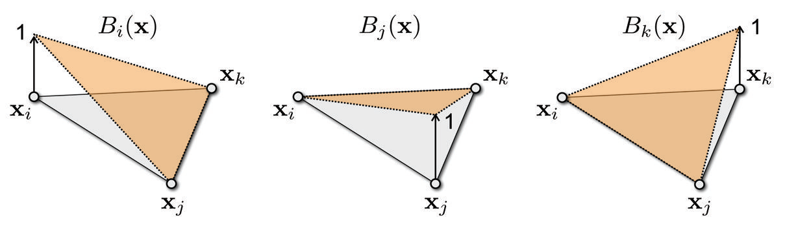

在上一篇介绍离散拉普拉斯算子的文章之后，补充一下三角形网格上的梯度算子的推导过程。

- 接下来是具体的推导过程以下面的这张图为例说明：

- 由于在每个顶点处都对应了一个标量值，用 $f(v_{i})$ 表示顶点 $v_{i}$ 处标量的值，不妨假设在每一个三角形的内部标量值的分布都是线性的（其实纹理坐标的映射也是这样，三角形的三个顶点映射到三个纹理坐标之后，内部直接采用线性插值决定颜色），可以采用重心坐标插值公式：
$$
f(u)=f(v_{i})B_{i}(u)+f(v_{j})B_{j}(u)+f(v_{k})B_{k}(u)
$$
- 来表示在三角形内部的每一个点 $u$ ，由于这个式子当中 $f(v_{i}),\ f(v_{j}),\ f(v_{k})$ 都是常量，求梯度的时候不发生改变，梯度的公式近似表示为
$$
\nabla f(u)=f(v_{i})\nabla B_{i}(u)+f(v_{j})\nabla B_{j}(u)+f(v_{k})\nabla B_{k}(u)
$$
- 接下来以上图中的第一个例子说明，对于插值函数 $B_{i}$ ，有 $B_{i}\in [0,1]$ ，并且当 $u=v_{i}$ 时才有 $B_{i}(u)=1$ ，当 $u=v_{j}$ 或者 $u=v_{k}$ 都有 $B_{i}=0$ ，因为**标量函数的梯度方向是使得标量函数变化最剧烈的方向**，不难看出这个方向是垂直于边 $x_{j}x_{k}$ 的，在 $\Delta x_{i}x_{j}x_{k}$ 里面 $B_{i}$ 沿着 $\vec{n_{jk}}$ 的方向是线性地从 $1$ 变化到 $0$ （因为有了这个性质，所以之后计算散度的时候对这个函数求梯度会直接得到一个常量），于是有了下面的表达式：
$$
\nabla B_{i}=\frac{||x_j-x_k||\vec{n_{jk}}}{2S_{\Delta ijk}}
$$
- 上面的公式当中 $\vec{n_{jk}}$ 是边 $jk$ 的垂直方向，指向三角形的外部。
- 把上式带入到第二个式子中可以得到：
$$
\nabla f(u)=\sum_{i}\frac{||x_j-x_k||\vec{n_{jk}}f_i}{2S_{\Delta ijk}}
$$
- 除了上面的表示方法，由于上面的三个插值函数满足性质：
$$
B_{i}+B_{j}+B_{k} = 1
$$
- 所以对等式两边同时求梯度（导数）可以得到：
$$
\nabla B_{i}+\nabla B_{j}+\nabla B_{k} = 0
$$
- 对于之前总结得到的公式可以进一步简化得到：
$$
\nabla f(u)=(f_{j}-f_{i})\nabla B_{j}+(f_{k}-f_{i})\nabla B_{k}
$$
- 上面的公式就是直接用在求`laplace-cotan`公式中的梯度形式。