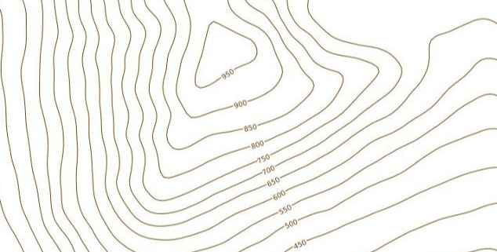
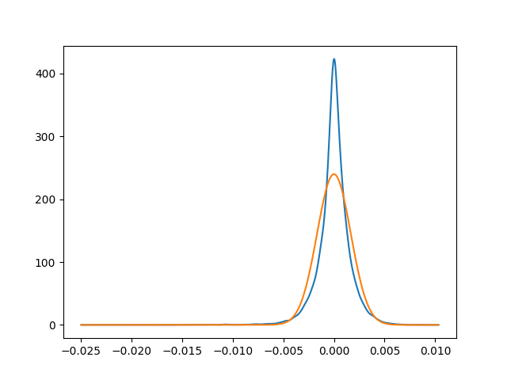
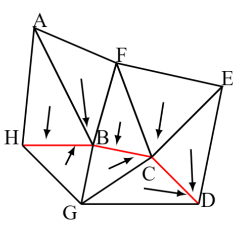

这里的模型研究的是三角形网格。脊线结构可以理解成在用模型上的某一个点作为源点，求出模型的等值线之后，等值线上出现的类似于山脊结构的部分，可以结合下面的测地线的图理解一下。

在这个图上面可以看到950等值线围绕着一个山峰，从这个山峰的西南方向有一个类似于山脊的结构，这种结构在一个模型上也是存在的，而且受制于传统求测地线距离算法的缺陷，对于这个结构附近的三角形加上纹理坐标，由于纹理坐标对一个三角形内部作线性插值，导致山脊处的“峰值”信息丢失，往往会让显示效果很不好，为了解决这个问题，我们需要一个找到这种脊线结构的方法，并且对脊线附近特殊处理，保留峰值信息。

## 方法思路
- 在之前已经学习了散度的概念，如果我们把计算出的测地距离标量场求梯度向量场，得到从源点向外“扩散”的方向，从直觉上说，脊线结构是这样的梯度向量汇集的地方（或者说是少量聚集的地方），最终的山脚是所有周围梯度向量汇集的地方，山顶是所有周围梯度都发散的地方，其他的地方更近似于有进入他的邻域的梯度向量，也有近似等量的梯度向量离开。
- 有了这样的想法，我们把梯度向量场单位化。我们想要的脊线结构的顶点的散度应当是一个较小的负数（相对于源点和其他的有流入又有相当量流出的顶点来说）。按道理说可以过滤而出这些点。

- 在上面的图片中，我把每个顶点的散度标准化到 $[0,1]$ 区间之后作为顶点的纹理坐标。散度越大，表现为红色，反之为蓝色。从图中可以看出有一条比较明显的蓝色轨迹，这就是我希望要保留的脊线结构。接下来要找一个方法把这些点过滤出来，需要注意的是，脊线结构应该是一个连续的结构，对于`armadillo`这种亏格为 $0$ 的模型来说，应该是一棵树。
- 我接下来对这些梯度值进行了分析，得到了一张概率密度函数图像

- 这个概率密度函数的橙色曲线是用散度的数据得到的标准正态分布，函数表达式为 $f(x) = \frac{1}{2\sigma}\ e^{\frac{(x-\mu)^2}{\sigma^2}}$ 。我认为这两个曲线的相似程度已经比较高了（虽然这里应该用假设检验严格分析，但是这里跳过检验的步骤）。用正态分布的均值和方差（也是原来数据的均值方差）过滤数据，取 $[min, \mu-3\sigma]$ 区间内的值作为我想要的脊线的顶点。
- 这样做有很明显的缺陷，得到的脊线不是连续的，因为通过散度来过滤一个离散的模型上的点是存在误差的，而且散度是一种基于局部特征的方式，可能会有模型表面凹凸不均导致不应该选中的点被选中。
- 为了解决这两个问题，我继续删除了较小的分支（含有的顶点数目不大于2的分支），并且从得到的脊线的断端开始向外生长，连接别的分支，希望能够得到比较连续的脊线。
- 一种符合直觉的生长算法是利用断端处周围的梯度向量的方向，如果断端处确实是一个周围的梯度向量“流向”的“山谷”，这个“山谷”的两侧的梯度向量应该是以几乎垂直的方向指向这个“山谷”的。这也就是说对于脊线附近可以类似下图表示梯度向量的关系：

- 假设这里的 $D$ 是断端，可以认识到 $D$ 附近的梯度向量是倾向于沿着断端继续向着“更低”的山谷流动的，如果我们用断端 $D$ 和它的邻居组成一个向量，这条边向量和这条边相邻的两个面上的单位化梯度向量的内积之和应当是存在一定的规律的。对于那些希望继续走下去的断端，希望继续走下去的边得到的值应当是一个较大的正数，相反的方向是一个较小的负数，对于从两侧汇集到“山谷”的方向，几乎是垂直于边的，接近于 $0$ 。用这个思路可以拓展断端，直到到达一个设置好的不能继续生长的终止条件。下面的`bunny`是用这种方式延展过后的模型，红色的线条是最初过滤出来的断开的脊线，蓝色的线条是通过这种方式生长出来的脊线。

## 错误分析

- 从得到的结果已经可以看出，生长过后的脊线仍然是不连续的，这和生长的方式过于粗糙有很大的关系。对于一个离散的模型，用这种采样的方式很难得到想要的结果。一个顶点的邻居节点并不多，用向量内积后相加的方法本身缺乏可靠性，很容易受到模型表面的一些性质影响，鲁棒性很差。
- 而且这种方式最根本的问题是一直使用散度这种局部的信息，很难克服模型表面凹凸不平的影响，如果想要得到更好的结果，需要加入一种考虑到整体性质的方法，这也是之后完全重来的方法的起始思路。
