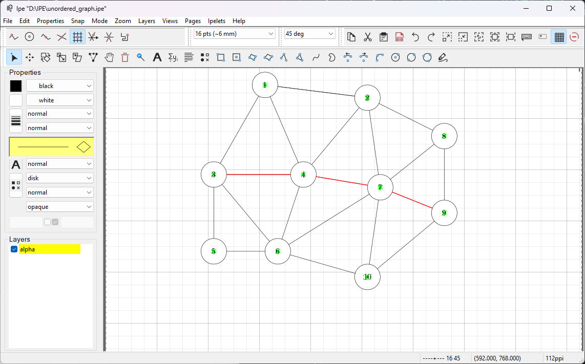
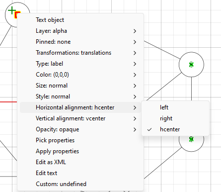
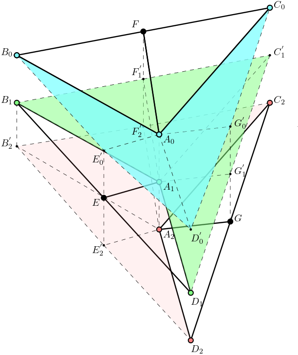
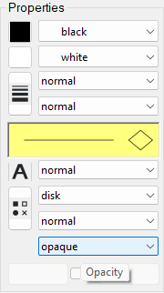

[IPE](https://ipe.otfried.org/)是一款能够很方便绘制矢量图形的的软件，而且是开源的，遵循[GPLv3](https://www.gnu.org/licenses/gpl-3.0.en.html)开源协议，这个协议比较通俗的解释可以找[这个网站](https://doc.yonyoucloud.com/doc/sfd-gpl/gplv3.html)，这里归纳一些我自己常用的功能和[一些资源](矢量绘图软件-IPE/outline.pdf)。

## 常用的快捷键
- `s`:选择
- `t`:平移
- `r`:旋转
- `p`:画多边形（线）
- `m`:画点
- `l`:文字
- `shift`+`4`:latex文本
- `e`:拉伸
- `o`:按照圆心和半径画圆

## 用来绘制常用的图
- windows下7.2.26版本的界面是这样的

- 如果想要画出把下面的边遮挡住的圆形表示顶点，需要先把下面的边画出来，然后在上面画圆形。圆形选择边框和填充，填充用白色，就可以把下面的线盖住。
- 如果需要在圆形的正中心画上数字或者字母，可以选择label或者latex输入字符，输入完后手动把文字的水平居中和垂直居中打开，参考下面的图片。

- 如果需要把两个顶点之间的线用红色显示，一个办法是让原本底下的线就是红色的，让圆形去覆盖这条线。还有一个办法是打开上面的选择交点，这样IPE能够找到圆形和下面被遮盖住的线的交点，利用两个交点画一条新的线覆盖原来的线也可行。下图中蓝色选中左边的选项就是选中交点。

## 绘制更复杂的图形
有时我们想要这种包含透明的三角形的图（虽然这里的例子用三维模型渲染效果应该会更好）

- 比较重要的是把握好哪一层在下面，先画最下层可能被遮盖住的部分。或者我们可以用不同的图层，图层创建可以用`ctrl`+`shift`+`N`，也可以在上面的菜单栏找。
- 每一个多边形（快捷键`p`）绘制出来可以设置填充颜色的不透明度，可以修改左边property的opaque选项。
