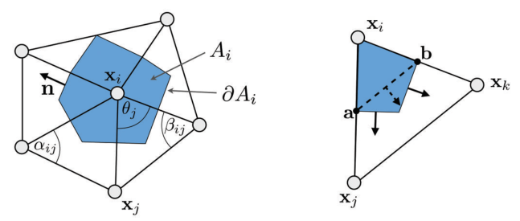

在之前读的论文中涉及到离散拉普拉斯算子，但是当时对这一基础非常不了解，通过[一些资料](https://zhuanlan.zhihu.com/p/67336297)学习后留下一篇笔记记录一下学习的心得，也用于之后有机会复习。

## 散度
- 从物理中的定义大概可以知道，散度是一个通过包围一个体积元的封闭曲面的通量大小除以这个体积元的体积，从定义可以知道这是一个标量，用来衡量一个空间中矢量场的分布特征。（通量在这里通过 $\Phi=\iint_{S}\vec{A}\cdot\vec{n}\ dS$ 表示，$\vec{n}$ 在这里表示当前的这个封闭曲面的面积元的法向量方向，对于一般的模型，定义法向量指向表面的外部）用公式表示散度可以是： $$\nabla A=\lim_{dV \to x}\frac{\Phi_{A}(\Sigma)}{dV}$$ 上面的公式表示当一个体积元 $dV$ 趋近于一个点 $x$ 的时候这个点 $x$ 的散度大小。
- 从以上的定义可以知道，**散度的正负性衡量了在某一个点在一个空间矢量场里面通量的正负性**，换句话说，对于散度为正数的点，散度越大，表示向量场在此处发散的水平越强烈，反之亦然。有的时候如果我们只想要保留这样的发散或者说聚拢性质，可以把已知向量场单位化，然后直接求散度。

## 拉普拉斯算子
- 一个函数 $f$ 的拉普拉斯算子一般可以表示为 $\Delta f=\nabla (\nabla f)$ ，也就是这个函数的梯度的散度，一个标量函数的梯度 (迪卡尔坐标系下可以表示成 $\nabla f=\frac{\partial f}{\partial x}\cdot\vec{i}+\frac{\partial f}{\partial y}\cdot\vec{j}+\frac{\partial f}{\partial z}\cdot\vec{k} \vert_{x=x_{0},\ y=y_{0},\ z=z_{0}}$ ) 是一个向量（每一点的梯度值组合在一起成为一个向量函数，衡量了定义域中的每一个点处梯度向量的值）。
- 可以用这样的比喻理解，让我们想像一座山，根据梯度的定义，在山峰周围，所有的梯度向量向此汇聚，所以每个山峰处的散度是一个很大的负数；而在山谷周围，所有梯度从此发散，所以每个山谷处的散度则是一个很小的负数。所以说，对于一个函数，**拉普拉斯算子作用于一个标量函数之后，实际上衡量了在空间中的每一点处，该函数梯度是倾向于增加还是减少**。
- 由此可以理解物理中的一个公式 $\nabla^{2}f=0$ 所表达的意思为空间中的每一点的梯度都倾向于不变，也就是此时已经处于一个相对平衡的状态。也可以理解成，对于每一点空间中的“邻域”，进入这个区域的向量和离开这个区域的向量大致是相等的。

## 图函数，图函数的梯度
- **一个图函数可以被定义为图中每一个顶点到一个实数的映射**（$F:V\rightarrow R$）
- 图函数的梯度的定义可以从梯度本身的定义出发，**梯度定义为一个函数在每一个点，在所有的正交方向上的变化**，比如说 $f$ 在 $x$ 方向上的分量表示为 $\frac{\partial f}{\partial x}\cdot\vec{i}$ ，在图论当中，我们可以认为一个顶点通过边连接到相邻的几个顶点，而这些相邻的顶点之间没有什么联系，也就是**将这个顶点每一条相邻的边都看作是一个正交方向**，在下面的图当中，对于两个相邻的顶点，它们之间的距离 $d$ 被定义为他们之间边权的倒数（以社交网络为例，每个顶点都代表了一个人，每条边的边权都表示两个人之间通讯的频率，边权越高表示两个人之间通讯越频繁，图函数可以用来表示每个人的活跃程度，不过按照我的理解，根据实际的要求可以给出别的定义，不同的定义适用于不同的要求）。
- 有了以上的定义，可以定义从顶点 $v_{0}$ 到顶点 $v_{1}$ 的梯度为 $\frac{f(v_{0})-f(v_{1})}{d_{01}}=(f(v_{0})-f(v_{1}))\times e_{01}$ ，接下来定义一个矩阵 $K_{G}$，让这个矩阵的每行每列有如下表格的含义：

$$
\begin{array}{|c|c|c|c|c|c|c|c|}
  \hline
  {}&{e_{ab}}&{e_{ac}}&{e_{bd}}&{e_{dc}}&{e_{de}}&{e_{be}}\\\\
  \hline
  {A}&{-5}&{-3}&{0}&{0}&{0}&{0}\\\\
  \hline
  {B}&{5}&{0}&{-7}&{0}&{0}&{-2}\\\\
  \hline
  {C}&{0}&{3}&{0}&{1}&{0}&{0}\\\\
  \hline
  {D}&{0}&{0}&{7}&{-1}&{-4}&{0}\\\\
  \hline
  {E}&{0}&{0}&{0}&{0}&{4}&{2}\\\\
  \hline
\end{array}
$$
- 上面的矩阵的每一列都是一条边，每一列都是一个顶点，每列中两个值分别是出发点以及终点乘以边权，出发点为负数，终点为正数，接下来再定义一个向量 $f_{G}$，这个向量表示我们给图中的每个顶点给定一个初始值，也就是之前定义的图函数。
$$
f_{G}=
\begin{pmatrix}
  3 \\\\
  5 \\\\
  -2 \\\\
  1 \\\\
  -5
\end{pmatrix}
$$
- 为了求出梯度，计算 $K_{G}^{T}\times f_{G}$ 如下：
$$
\begin{pmatrix}
  -5&5&0&0&0 \\\\
  -3&0&4&0&0 \\\\
  0&-7&0&7&0 \\\\
  0&0&1&-1&0 \\\\
  0&0&0&-4&4 \\\\
  0&-2&0&0&2
\end{pmatrix}\times
\begin{pmatrix}
  3\\\\5\\\\-2\\\\1\\\\-5
\end{pmatrix}=
\begin{pmatrix}
  10\\\\-15\\\\-28\\\\-3\\\\-24\\\\-20
\end{pmatrix}
$$
- 经过观察我们可以知道，最后计算结果的向量，即是整个图 $G$ 在函数 $f$ 上的梯度，其中每一行，为该梯度在一条边上的分量，对于这个图 $G$ ，梯度算子 $\nabla_{G}=K_{G}^{T}$

## 图中的拉普拉斯算子，拉普拉斯矩阵
- 通过上面的推导，已经得到了**图中的梯度算子**。回想之前对于散度的定义，不难联想到，对每个顶点来说，用进入这个顶点的梯度减去离开这个顶点的梯度就可以得到这个顶点的散度，仍然是上面的图，可以得到矩阵 $K_{G_0}$ ：
$$
\begin{pmatrix}
  -1&-1&0&0&0&0\\\\
  1&0&-1&0&0&-1\\\\
  0&1&0&1&0&0\\\\
  0&0&1&-1&-1&0\\\\
  0&0&0&0&1&1
\end{pmatrix}
$$
- 这里的每一行表示一个顶点，一行中的 $1$ 表示一条边指向这个顶点， $-1$ 则表示离开这个顶点，现在用 $L=K_{G_0}\times K_{G}^{T}$ 表示拉普拉斯矩阵，这个图 $G$ 在函数 $f$ 下的散度也就表示为 $\Delta G=L\cdot f_{G}$
$$
K_{G_0}\times K_{G}^{T}=
\begin{pmatrix}
  8&-5&-3&0&0\\\\
  -5&14&0&-7&-2\\\\
  -3&0&4&-1&0\\\\
  0&-7&-1&12&-4\\\\
  0&-2&0&-4&6
\end{pmatrix}
$$
- 经过观察可以知道， $K_{G_0}\cdot K_{G}^{T}$ 对角线元素为每个顶点的度，其他的元素是邻接矩阵的相反数，可以最终表示为 $L=D-W$。
- 通过上面的证明，得到了一个非常经典的结论，对于一个图，可以简单地把它的拉普拉斯算子（拉普拉斯矩阵）用这个图的度数矩阵减去边的权值矩阵。但是这种方式明显没有利用到图中边之间的夹角信息，虽然在传统的图存储中不关心这些边和顶点的具体位置关系，只考量他们的连通关系，但是对于下面在三角形网格中的应用，就不能把这种信息忽略。

## 拉普拉斯矩阵的性质
- 拉普拉斯矩阵之所以如此常用，是因为其一大重要性质： 拉普拉斯矩阵的 $n$ 个特征值 $\lambda_{1},\,\lambda_{2},\, \cdots\lambda_{n}$ 都是非负值，且有 $0=\lambda_{1} \le \lambda_{2} \le \cdots \le \lambda_{n}$

## 更为常用的laplace-cotan公式
- 上面介绍的是通用的**图拉普拉斯矩阵（算子）**，但是上面的算子并不适用于图形学中常用的三角形网格。
- 首先要回顾一个`mesh`上面梯度的计算公式:
$$
\nabla f(u)=(f_{j}-f_{i})\nabla B_{j}+(f_{k}-f_{i})\nabla B_{k}
$$
- 这里的 $f_i$ 表示在三角形的顶点 $i$ 上的标量函数值， $\nabla B_j$ 表示顶点 $j$ 的重心插值系数函数的梯度，由于这是一个线性函数，得到的梯度是一个常数。梯度向量十一三角形为单位的，每个三角形对应唯一一个梯度向量，并且梯度向量的值仅仅与这个三角形的几何形状（重心插值系数函数）和三个顶点上的标量函数值有关。
- 仍然利用散度去理解这个过程，但是我们把三维的梯度简化看作是二维的。我们定义`mesh`上面一个顶点的散度为顶点附近区域内三角形梯度的得到的散度的总和，用公式来表示就是：
$$
\int_{A_{i}}div(\nabla f(u))dA
$$
- 接下来用这个图片辅助理解  
这个图片中的蓝色区域是 `Voronoi Region` ，是每条边上的中垂线组成的
- 如果我们认为这个区域 $A$ 是足够小的，用散度本来的定义，穿过一个封闭曲面的通量，可以把这个散度再表示为
$$
\int_{\partial A}\nabla f(u)\cdot\vec{n(u)}\ ds
$$
- 这表示了一个三角形内部梯度向量和区域 $A$ 的边界法向量的内积的总和，也就是梯度向量对于这个区域 $A$ 的“通量”，根据`Voronoi Region`的性质，可以得到
$$
\int_{\partial A \cap \Delta ijk}\nabla f(u)\cdot \vec{n(u)}\ ds=
\nabla f(u)\cdot ||ab||\vec{n_{ab}}=
\nabla f(u)\cdot \frac{||jk||\vec{n_{jk}}}{2}
$$
- 这个式子当中的 $\vec{F(u)}$ 是三角形内部的梯度，带入之前已经推导出的梯度公式可以得到
$$
\int_{\partial A \cap \Delta ijk}\nabla f(u)\cdot \vec{n(u)}\ ds=
\frac{||ik||\vec{n_{ik}}\cdot ||jk||\vec{n_{jk}}(f_{j}-f_{i})}{4S_{\Delta ijk}} \\
+\frac{||ij||\vec{n_{ij}}\cdot ||jk||\vec{n_{jk}}(f_{k}-f_{i})}{4S_{\Delta ijk}}
$$
- 接下来假设 $\angle ikj=\gamma_{k}$ ，$\angle ijk=\gamma_{j}$ 由于 $cos(\gamma_{k})=\vec{n_{jk}}\cdot \vec{n_{ik}}$ ， $\frac{1}{sin(\gamma_{k})}=\frac{||ik||\times ||jk||}{2S_{\Delta ijk}}$ ，可以把上式转化成
$$
\int_{\partial A \cap \Delta ijk}\nabla f(u)\cdot \vec{n(u)}\ ds=
\frac{1}{2}(cot(\gamma_{j})(f_k-f_i)+cot(\gamma_{k})(f_j-f_i))
$$
- 把上式从对于一个三角形拓展到与当前的顶点 $i$ 相邻的每一个三角形，可以得到总的式子
$$
\int_{A} \Delta f(u)\ dA=
\sum_{v_j\in N(u)}(cot(\alpha_{i,j})+cot(\beta_{i,j}))(f_j-f_i) \\
\Delta f(u) = \frac{1}{A_u}\ \sum_{v_j\in N(u)}(cot(\alpha_{i,j})+cot(\beta_{i,j}))(f_j-f_i)
$$
- 这里的两个角度 $\alpha_{i,j},\beta_{i,j}$ 已经标注在了上面的图中， $N(u)$ 是顶点 $u$ 的所有邻居组成的集合。上面的公式就是著名的`laplace-cotan`公式。
- 也很容易想到，上面的公式是基于三角形网格的，图形学中还有很多不用三角网个表示的模型。比如说四边形网格，点云，以及一些隐式表示的模型，这些模型的laplace算子都需要重新推导，这里只介绍了三角形网格上的情况，后续学习中如果用到了别的类型算子再补充。